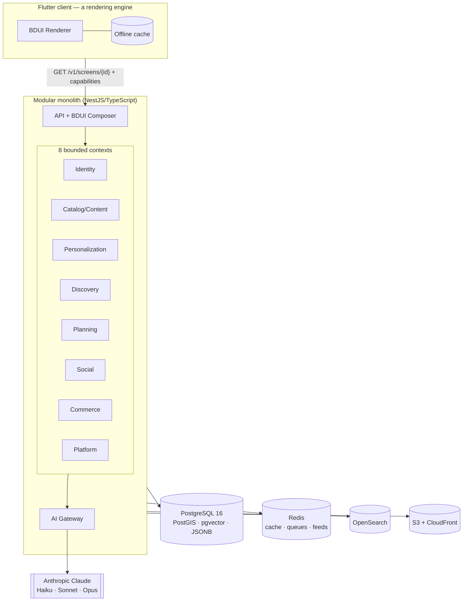

# Firo — Architecture Overview

> **Phase 1 deliverable: architecture only. No application code yet.**
> This document set is the reviewable output of Phase 1. It records the
> decisions, trade-offs, risks, and the challenges we raise against the
> original product brief. Nothing here is built until it is approved.

## What Firo is (and is not)

Firo is an **AI-powered travel _discovery_ platform**. Its mission is to help
every person discover experiences that feel *personally made for them*.

- It is **not** a booking engine. Philosophy: **Inspire first. Plan second. Book last.**
- It is **not** a map. Geography is a substrate, not the product.
- It is **not** a social pinboard. The feed is personalized by intent, not by follows.

The experience must feel **minimal, premium, emotional, and intelligent**.

## The one-paragraph architecture

Firo is a **modular monolith**: a single deployable backend, split into
hard-bounded modules (bounded contexts), plus a twin background-worker process
built from the same codebase. It is backed by **one PostgreSQL cluster**
(schema-per-module), **Redis**, **OpenSearch**, and **S3 + CloudFront** for
media. The mobile app is a **thin rendering engine** (Flutter) driven by a
**Backend-Driven UI (BDUI)** protocol: the server composes every screen and the
client renders it natively. AI (Anthropic Claude, tiered) lives behind a single
**AI Gateway** that no business module may bypass. The whole system is designed
with the **seams** to split into services at 100M users, but is **built and
deployed for ~100K** — we pay the scaling cost only when a written trip-wire
fires.

## The five decisions everything else hangs on

1. **Backend-Driven UI, drawn at the _semantics vs presentation_ line.** The
   backend owns *what* to show, *in what order*, to *whom*, wired to *which*
   actions. The client owns *how* it looks and moves. See
   [ADR-0003](../adr/0003-bdui-semantics-vs-presentation-boundary.md).
2. **Modular monolith, not microservices.** Eight bounded contexts with hard
   internal boundaries. Extract a service only when a trip-wire fires. See
   [ADR-0001](../adr/0001-modular-monolith-over-microservices.md).
3. **PostgreSQL as the single source of truth**, with four purpose-built stores
   around it that Postgres genuinely can't do well. See
   [04-data-architecture](04-data-architecture.md).
4. **REST + BDUI, no GraphQL.** With BDUI the server already decides the exact
   shape of every screen; a client query language fights that. See
   [ADR-0005](../adr/0005-reject-graphql.md).
5. **Design the seams for 100M, build for 100K.** UUIDv7 keys, stateless
   services, cursor pagination now; sharding, CDC pipelines, and multi-region
   deferred behind trip-wires.

## Where we push back on the brief

The brief is ambitious and mostly right, but four of its instructions would hurt
the product or the timeline if taken literally. We reject each and give a better
alternative. These are summarized in [09-challenges-to-the-brief](09-challenges-to-the-brief.md)
and enforced by the ADRs.

| Brief says | We say | Why |
|---|---|---|
| Backend controls *everything*, incl. animations & spacing | Backend controls semantics; client owns motion/spacing | Server-driven pixels = laggy, generic UI — the opposite of "premium" |
| ~25 independent modules | 8 bounded contexts | 25 nano-services is a staffing model we don't have |
| AI as separate services (plural) | One AI Gateway + worker pool | Decouple logically, don't fragment operationally |
| Every interaction updates Explorer DNA (synchronously) | Every interaction *influences* DNA, folded asynchronously | Synchronous DNA writes become the scaling bottleneck |
| "Everything configurable" | Configure presentation & policy; keep invariants in typed code | Config'ing safety/eligibility logic is how you ship bugs |

## Document map

| Doc | Contents |
|---|---|
| [01-principles](01-principles.md) | Clean Architecture, config-vs-code, the semantic boundary |
| [02-topology](02-topology.md) | Modular monolith, the 8 contexts, folder trees, comms |
| [03-bdui-engine](03-bdui-engine.md) | The crown jewel: wire contract, schema, composition |
| [04-data-architecture](04-data-architecture.md) | Stores, domain model, table sketches, durability tiers |
| [05-recommendation-and-explorer-dna](05-recommendation-and-explorer-dna.md) | The feed funnel + evolving user profile |
| [06-ai-layer](06-ai-layer.md) | AI Gateway, capabilities, cost controls |
| [07-platform-security-observability](07-platform-security-observability.md) | Infra, CI/CD, auth, RBAC, observability |
| [08-api-and-design-system](08-api-and-design-system.md) | API conventions, contracts, design tokens |
| [09-challenges-to-the-brief](09-challenges-to-the-brief.md) | Every pushback, with the better alternative |
| [../adr/](../adr/) | Architecture Decision Records |
| [../RISKS.md](../RISKS.md) | Adversarial red-team findings & mitigations |
| [../ROADMAP.md](../ROADMAP.md) | The phased delivery plan |
