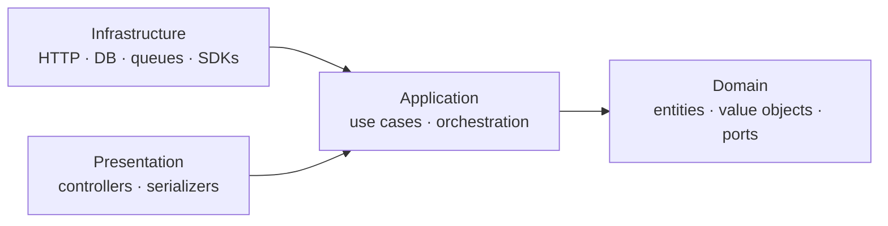

# Principles & Clean Architecture

These principles are binding. Every module, ADR, and code review is measured
against them.

## 1. Clean Architecture, per module

Every bounded context is layered so that **business logic never depends on a
framework**. Dependencies point inward only.

- **Domain** — framework-free. Entities, value objects, domain services, and
  **ports** (interfaces). No imports of NestJS, Postgres, Redis, or the
  Anthropic SDK. Pure TypeScript.
- **Application** — use cases orchestrate the domain through ports. Transaction
  boundaries live here.
- **Infrastructure** — adapters that implement the ports (Postgres repositories,
  Redis caches, HTTP controllers, the AI Gateway client).
- **Presentation** — controllers, DTO mapping, serialization to the API envelope.

The test of a correct boundary: *you can unit-test the domain and application
layers with zero infrastructure and zero mocks of the framework.*

## 2. Configure presentation and policy — not invariants

The brief says "never hardcode application logic; everything possible should be
configurable." Taken literally this is dangerous. We split the world in two:

| **Configure** (changes often, low risk) | **Keep in typed, tested code** (invariants) |
|---|---|
| BDUI layout, section order, visibility | Auth & permission checks |
| Feature flags, experiment variants | Pricing, eligibility, entitlement rules |
| Copy, thresholds, ranking weights | Data integrity & validation |
| Theme tokens, onboarding step order | Safety, moderation, guardrails |

Rule of thumb: **if a wrong value is a marketing mistake, configure it; if a
wrong value is a security incident or a corrupt record, code and test it.**

## 3. The semantic boundary (the most important line in the system)

Backend-Driven UI is a **semantic protocol, not a remote UI framework**.

- **Backend owns SEMANTICS:** which screens exist; which sections appear, in what
  order, with what visibility; which *component type*; the content and copy; the
  *actions*; targeting/experiment/theme *selection*; and emphasis/density
  **intent** (enums like `hero`, `comfortable`).
- **Client owns PRESENTATION:** the actual native widget for each type; animation
  curves, springs, haptics; the spacing scale (resolved from tokens); gesture and
  scroll physics; 60/120fps rendering; the native accessibility tree.

The backend may say `emphasis: "hero"`, `density: "comfortable"`,
`themeId: "firo.dark"`. It may **never** say `marginTop: 14`,
`animationDurationMs: 320`. Those fields do not exist in the contract.

This is what keeps Firo feeling premium: **the backend orchestrates the story;
the native client performs it.**

## 4. High cohesion, low coupling, real boundaries

- A module owns its data (one Postgres schema) and exposes a single
  `public-api` port. Other modules call that port; they never reach into another
  module's tables.
- Cross-module references are soft (`*_id` + `*_module`), validated in the domain
  layer — but see [ADR-0004](../adr/0004-postgres-single-source-of-truth.md): in
  Phase 1 we keep **real foreign keys inside the single cluster** and enforce
  boundaries with lint + schema ownership, rather than paying distributed-systems
  costs before we have a distributed system.

## 5. Design the seam, defer the machinery

For every "at 100M users" concern we build the **seam** (a cheap structural
choice that makes the future change mechanical) and defer the **machinery** (the
expensive thing) behind a written **trip-wire** — a measurable threshold that
tells us *when* to build it. No speculative sharding, no day-one Kafka, no
premature vector database. Trip-wires are recorded in each pillar doc.

## 6. Quality bar

Strict TypeScript, lint + format in CI, meaningful names, SOLID, DRY, KISS.
Extensibility is designed in; optimization is deferred until measured. Tests are
required on domain and application layers; contract tests guard every published
schema.
