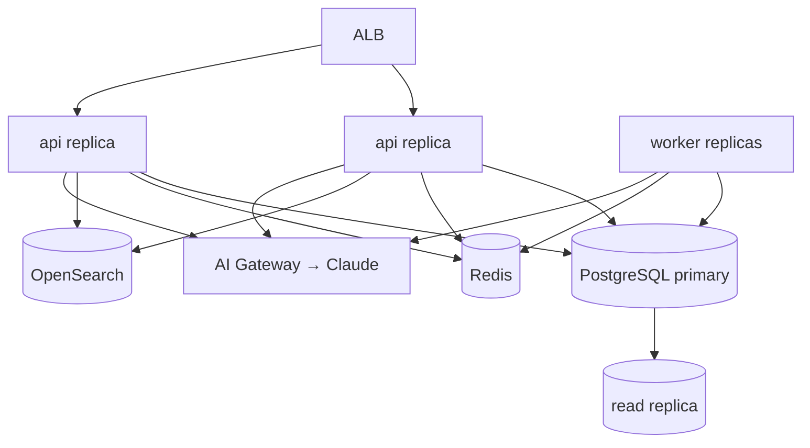

# System Topology

## Deployment shape

**One backend service (`api`) + one worker process (`worker`)**, built from the
same codebase, behind a load balancer. This is a **modular monolith**: internal
module boundaries are hard, but there is one deployable and one database cluster.



*Why not microservices now?* We have a small team and no users. Microservices
buy independent scaling and deploy isolation at the cost of network calls,
distributed transactions, and operational overhead we cannot yet afford. The
modular monolith gives us the **same extraction seam** (see below) without the
tax. See [ADR-0001](../adr/0001-modular-monolith-over-microservices.md).

## Backend stack

| Concern | Choice | Justification |
|---|---|---|
| Language/runtime | **TypeScript, Node 22 LTS** | One type language across backend, contracts, and (generated) client; first-class Anthropic SDK; fast iteration |
| Framework | **NestJS** (Fastify adapter) | Modules + DI map 1:1 onto bounded contexts and Clean-Arch ports; batteries-included without a JVM |
| Primary DB | **PostgreSQL 16** | See [04-data-architecture](04-data-architecture.md) |
| Cache/queues | **Redis** (+ BullMQ) | Cache, rate-limit, background jobs, materialized feeds |
| Search | **OpenSearch** | Relevance + geo + facets |
| Monorepo tooling | **Nx** (or Turborepo) | Task graph, affected-only builds, boundary lint rules |

See [ADR-0002](../adr/0002-nestjs-typescript.md).

## The 8 bounded contexts

The brief lists ~25 "modules." We group them into **8 bounded contexts**. Each
context is a directory of NestJS feature modules; each owns one Postgres schema.

| Bounded context | Absorbs (brief modules) | Owns |
|---|---|---|
| **Identity** | Auth, Users, Settings, Permissions | accounts, sessions, roles, preferences |
| **Catalog / Content** | Countries, Regions, Cities, Places, Experiences, CMS, Media | the geo tree, experiences, editorial content, assets |
| **Personalization** | Explorer DNA, Recommendations | the evolving profile + the reco funnel |
| **Discovery** | Search, Feed, Collections, Dreamboards | search, the composed feed, saves & boards |
| **Planning** | Trip Planner, Expeditions | itineraries, trips, expeditions |
| **Social** | Community, Groups, Events, Messaging | memberships, groups, events, DMs |
| **Commerce** | Payments, Subscriptions | billing, plans, entitlements |
| **Platform** | Admin, CMS-admin, Analytics, Feature Flags, Experiments, Notifications, **BDUI**, **AI Gateway** | cross-cutting infrastructure & the config plane |

> **BDUI and the AI Gateway live in Platform** because they are cross-cutting
> composition/infrastructure, not a product domain.

## Folder layout — `firo-backend`

```
firo-backend/
├── apps/
│   ├── api/                      # HTTP entrypoint (composition root)
│   └── worker/                   # background jobs, event folding, enrichment
├── libs/
│   ├── platform/                 # BDUI, AI gateway, flags, experiments, notifications, admin, analytics
│   │   ├── bdui/
│   │   │   ├── domain/           # Screen, Section, ComponentNode, Action, ports
│   │   │   ├── application/      # compose-screen usecase, middleware, contributors
│   │   │   ├── infrastructure/   # controllers, redis cache, serialization
│   │   │   └── contracts/        # JSON Schema, golden payloads, component registry
│   │   ├── ai/                   # AiPort, gateway, prompt registry, workers
│   │   ├── flags/  experiments/  notifications/  admin/  analytics/
│   ├── identity/  catalog/  personalization/  discovery/  planning/  social/  commerce/
│   │   └── <module>/{domain,application,infrastructure,presentation}/
│   └── shared/                   # response envelope, error model, pagination, ids (UUIDv7), result types
├── contracts/                    # OpenAPI 3.1 source of truth (see 08-api-and-design-system)
├── db/                           # migrations (per-schema), seed, roles
├── infra/                        # terraform (see 07-platform)
└── docs/                         # this documentation set
```

Each `<module>` is a Clean-Architecture slice: `domain/ → application/ →
infrastructure/ + presentation/`.

## Module communication

- **Synchronous, in-process port calls** for the vast majority of cross-module
  work in Phase 1 — a direct method call across a published `public-api` port,
  inside the same transaction where needed. Simple, transactional, debuggable.
- **Asynchronous events** only where they earn their keep: the behavioral
  firehose (DNA signals), notification fan-out, and AI enrichment jobs. Phase 1
  uses **Redis Streams / BullMQ** for jobs and a **durable managed log**
  (Kinesis/PubSub) *only* for the high-volume behavioral firehose.
- **No transactional outbox, no Debezium/Kafka CDC in Phase 1.** These are a
  Phase-2 concern, added when we split a module or stand up the warehouse. (This
  reverses an early over-engineered draft — see [RISKS](../RISKS.md).)

## Boundary enforcement (CI, from day one)

- Nx module-boundary lint: a context may import another context **only** through
  its `public-api` barrel.
- Migration lint fails on `REFERENCES <other-schema>.` for cross-*module* FKs.
- Per-schema DB role: a module's connection can touch only its own schema plus
  explicitly granted read-model views.

## The extraction seam (how we get to 100M without a rewrite)

Because each module already (a) owns its schema, (b) talks only through a
`public-api` port, and (c) is stateless behind the load balancer, extracting a
hot module into its own service later is mechanical: swap the in-process port
adapter for an HTTP/gRPC client, move its schema to its own database, and deploy
it separately. We build **that seam** now and deploy **one service** today.
