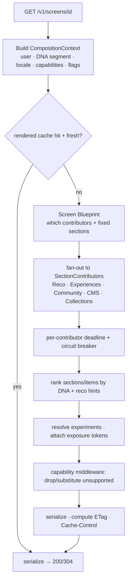

# Backend-Driven UI (BDUI) Engine

> The crown jewel. Read [01-principles §3](01-principles.md) first — the
> semantics-vs-presentation boundary is the foundation of everything here.

## What BDUI is

A **server-composed layout protocol**. The backend sends a versioned, typed tree
—`Screen → Sections → Components → {props, content, actions}`— and the client
renders each node natively via a **component registry**. The backend decides the
*story*; the client decides *how it looks and moves*.

BDUI is **not** a remote UI framework. There are no expressions, no scripts, no
geometry, and no timing values on the wire. That is a deliberate security and
performance boundary.

## The wire tree

```
Screen
 ├── meta (screenId, etag, ttl, themeId, experiments[], analytics)
 ├── header?  (Component)
 ├── sections[] (Section)
 │     ├── meta (sectionId, order, visibility, lazy)
 │     └── components[] (Component)
 │             ├── type        # registry key, e.g. "hero.v1"
 │             ├── id
 │             ├── props       # presentation INTENT only (enums)
 │             ├── content     # data, or a contentRef for lazy hydration
 │             ├── actions[]   # a closed, declarative vocabulary
 │             └── children[]? # for containers (carousels, grids)
 └── footer?  (Component)
```

Three **orthogonal** facets on every component, deliberately separated:

- **props** — *how to emphasize*: `emphasis` (`hero|standard|muted`), `density`
  (`compact|comfortable|spacious`), `aspect`, `variant`. Enums only. **No pixels.**
- **content** — *the data*: title, media refs, entity refs — or a `contentRef`
  the client hydrates lazily.
- **actions** — *what happens*: one of a fixed set of intents (below).

## Contract (JSON Schema, Draft 2020-12)

The contract is the single source of truth, frozen at `schemaVersion: 1`, and
lives in `libs/platform/bdui/contracts/schema/`. Types are generated from it for
both backend (TS) and client (Dart). Abridged component + action schema:

```jsonc
// component.schema.json (abridged)
{
  "type": { "type": "string", "pattern": "^[a-z_]+\\.v[0-9]+$" }, // "hero.v1"
  "id":   { "type": "string" },
  "props": {
    "properties": {
      "emphasis": { "enum": ["hero", "standard", "muted"] },
      "density":  { "enum": ["compact", "comfortable", "spacious"] },
      "aspect":   { "enum": ["16:9", "4:5", "1:1", "3:4", "auto"] }
    },
    "additionalProperties": true      // forward-compat: unknown props ignored
  },
  "content": { "oneOf": [ {"$ref":"#/inlineContent"}, {"$ref":"#/contentRef"} ] },
  "actions": { "type": "array", "items": { "$ref": "action.schema.json" } },
  "children":{ "type": "array", "items": { "$ref": "component.schema.json" } }
}
```

```jsonc
// action.schema.json — a CLOSED vocabulary. No code, no geometry, no timing.
{
  "trigger": { "enum": ["tap","long_press","appear","swipe","submit"] },
  "type":    { "enum": ["navigate","deep_link","open_url","present_sheet",
                        "submit","save","unsave","share",
                        "load_more","refresh_section","track","dismiss"] },
  "route":   "allowlisted route id (for navigate)",
  "url":     "allowlisted domain (for open_url)",
  "target":  "sectionId (for refresh/load_more)",
  "token":   "opaque, signed, validated server-side (for save/submit/track)"
}
```

Because actions are a closed set, **a payload can never execute code** — it can
only *request* one of a fixed set of intents, each validated by the client's
route/domain allowlist and (for server actions) a server-side token check.

## Example — Home / Feed screen (abridged)

```jsonc
{
  "schemaVersion": 1,
  "meta": {
    "screenId": "home.feed", "etag": "W/\"a1b2c3\"", "ttlSeconds": 120,
    "themeId": "firo.default", "themeVersion": "2026.07.1",
    "experiments": [{ "experimentId": "feed_hero_layout", "variant": "cinematic",
                      "exposureToken": "eyJ0..." }]
  },
  "sections": [
    { "meta": { "sectionId": "hero", "order": 0, "visibility": "visible" },
      "components": [{
        "type": "hero.v1", "id": "hero_1", "props": { "emphasis": "hero", "aspect": "3:4" },
        "content": { "kicker": "BECAUSE YOU LOVE COLD, QUIET PLACES",
                     "title": "Lofoten in the blue hour",
                     "media": { "ref": "media:img_lofoten_01" },
                     "entity": { "ref": "experience:exp_88213" } },
        "actions": [{ "trigger": "tap", "type": "navigate", "route": "experience_detail",
                      "payload": { "id": "exp_88213" }, "token": "sig_..." }]
      }]},
    { "meta": { "sectionId": "reco_carousel", "order": 1, "visibility": "visible" },
      "components": [
        { "type": "section_header.v1", "id": "sh_1",
          "content": { "title": "Because you saved fjord hikes" } },
        { "type": "carousel.v1", "id": "car_1", "props": { "aspect": "4:5" },
          "children": [
            { "type": "card.v1", "id": "c1",
              "content": { "ref": "experience:exp_101", "hydrate": "on_visible" } }
          ],
          "actions": [{ "trigger": "appear", "type": "load_more",
                        "target": "reco_carousel", "payload": { "cursor": "eyJ..." } }]
        }]}
  ]
}
```

Note: reco items are `contentRef`-hydrated `on_visible` (small payload, fast
first paint); the hero variant came from a server-resolved experiment; **nothing
dictates animation or spacing**.

## Component registry (Phase 1)

A **small, curated** registry ships first — composition dynamism is the value,
not registry breadth:

`app_bar.v1 · hero.v1 · section_header.v1 · card.v1 · carousel.v1 · grid.v1 ·
feed.v1 · story.v1 · banner.v1 · recommendation_block.v1 · onboarding_step.v1`

The client holds `Map<type, WidgetFactory>`. Types are versioned by the `.vN`
suffix so `hero.v1` and `hero.v2` are independently deprecatable. **Breaking a
component means minting a new `.vN` — never mutating an existing one.**

## Capability negotiation & graceful degradation

Every request advertises what the build can render; the server composes to that
envelope so a two-year-old binary degrades instead of crashing.

```
X-Firo-Schema-Version: 1
X-Firo-App-Build: ios/3.4.0 (5120)
X-Firo-Capabilities: video,image360,haptics,theme.dark
X-Firo-Components: hero.v1,carousel.v1,card.v1,...
If-None-Match: W/"a1b2c3"
```

Rules (frozen):
1. **Unknown component type →** client renders a mandatory non-crashing
   `UnknownComponentFallback`. (Server-side substitution of equivalents is a
   later phase.)
2. **Unknown props →** ignored (`additionalProperties: true`). Additive props are
   always backward-compatible.
3. **`If-None-Match` hit →** `304`, client renders its cached layout.

## Server-side composition pipeline



- **Contributors preserve module autonomy.** Each module implements
  `SectionContributor.contribute(ctx): Promise<SectionContribution[]>` and builds
  its *own* components. The composer only fans in, ranks, and serializes.
- **Resilience:** each contributor has a deadline; a slow/failing module's
  section is dropped or served stale, and the rest of the screen still renders
  (partial degradation over total failure).
- **The Screen Blueprint** (which contributors feed which screen) is config-driven
  so composition changes without a deploy — while component *types* stay
  client-bound.

## Caching

- Rendered-layout cache in Redis, keyed by `(screenId, coarseContextHash,
  schemaVersion, themeVersion)`. The context hash uses a **DNA _segment_ bucket**
  (hundreds of buckets), **not** the raw user id — this keeps cache cardinality
  sane. (See [RISKS](../RISKS.md): per-user caching does not scale; segment-level
  shell + per-user "hole punching" is the target design.)
- **Stale-while-revalidate** on the client: paint cached layout instantly,
  revalidate in the background, swap on `200`.

## Theming (server-influenced, client-realized)

Tokens are authored in Style Dictionary and delivered as a versioned, CDN-cached
`theme.json` via `GET /v1/theme/{themeId}`. Components reference **semantic token
names** (`color.surface.raised`, `radius.card`, `space.section`) — never raw
values. The client resolves names against the loaded theme, so dark mode and
future themes are pure client-side token swaps. `density` intent maps to a
`space.*` token on the client — server-*influenced* spacing without server pixel
control. See [08-api-and-design-system](08-api-and-design-system.md).

## Phase 1 scope for BDUI

**Build:** the frozen schema (Screen/Section/Component/Action/Theme), the ~11
component registry + unknown-component fallback, capability negotiation, the
action vocabulary + route registry, the `SectionContributor` interface, the
composition pipeline with Redis SWR caching, and golden example payloads
(`home.feed`, `onboarding.taste`) with contract tests.

**Scope BDUI to the screens where dynamism _is_ the value:** feed, discovery,
collection, content-detail, onboarding. **Keep auth, settings, and the nav shell
native** for now. (See [RISKS](../RISKS.md) — full-BDUI-everywhere in Phase 1 is
over-scope.)

**Defer:** server-side component substitution, CDN fragment caching, ML-driven
section ranking, a visual screen editor, whole-navigation-graph A/B tests, 360/AR
components.
