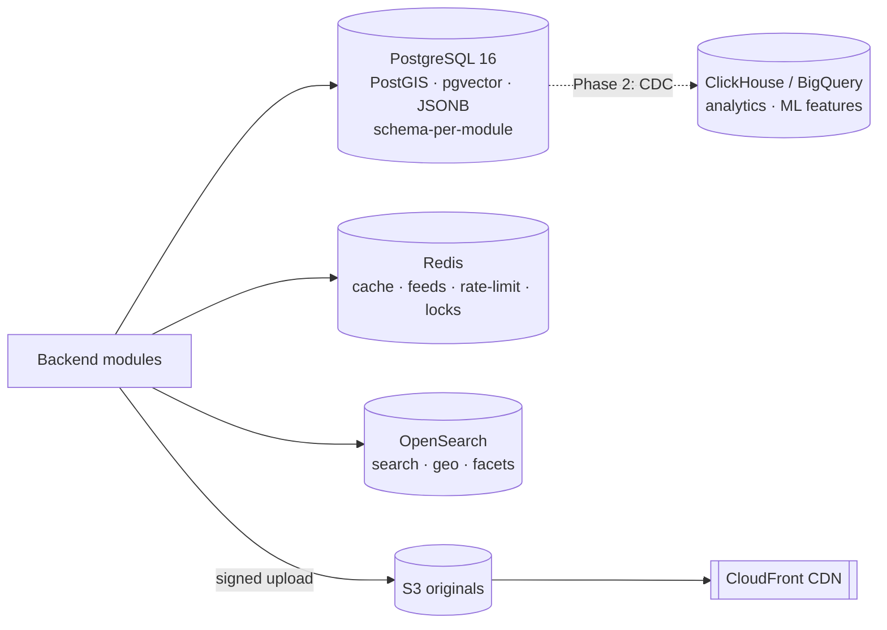
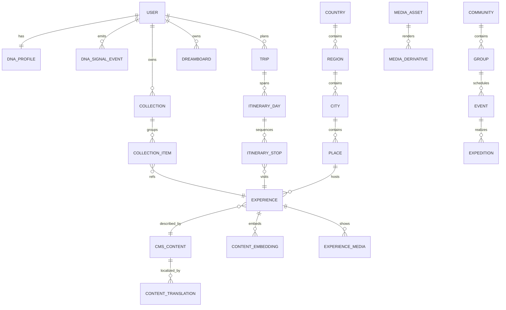

# Data Architecture & Domain Model

## Philosophy

PostgreSQL is the **system of record for everything transactional**. It is
"boring by default": PostGIS for geo, pgvector for embeddings, JSONB for
CMS/BDUI payloads. Around it sit exactly **four** purpose-built stores that
Postgres genuinely cannot do well. We explicitly **reject** a dedicated vector
DB, a graph DB, and a document DB for Phase 1 — each behind a written trip-wire.

## Store topology



| Store | Role | Why this and not more |
|---|---|---|
| **PostgreSQL 16** | OLTP truth for all aggregates; geo; vectors; JSONB | Transactions, integrity, one backup story. Carries us past 10M users vertically + replicas |
| **OpenSearch** | Text/semantic-lite search, `geo_distance`, facets, typo tolerance | A discovery product is search-first; Postgres FTS can't match product-quality relevance |
| **Redis** | Cache, materialized feeds, rate-limit, hot counters, locks | Sub-ms feed/BDUI reads; never a source of truth |
| **S3 + CloudFront** | Media originals + derivatives, signed URLs, CDN | Blobs never belong in Postgres; direct-to-S3 keeps the API thin |
| ~~Vector DB~~ | *(pgvector in Postgres for now)* | Written in-transaction with the entity; no dual-write. Trip-wire below |
| ~~Graph DB~~ | *(recursive CTEs + edge tables)* | Cover the geo tree + social adjacency at this scale |
| ~~ClickHouse/BigQuery~~ | *(Phase 2)* | Deferred with the CDC pipeline (see [RISKS](../RISKS.md)) |

**Trip-wires (when a deferred store becomes justified):**
- **Qdrant/Milvus:** > ~30–50M live vectors, *or* ANN p99 sustains > 20% OLTP CPU.
- **Graph DB:** ≥3-hop social/geo traversals exceed ~10% of query volume.
- **Citus / sharding:** single-primary write IOPS or storage crosses the managed
  ceiling with replicas maxed.
- **DB-per-module extraction:** a schema's deploy coupling or blast radius exceeds
  the shared-cluster budget.

## Module ↔ schema ownership

Each module owns exactly one Postgres schema. **Cross-*module* foreign keys are
forbidden** (enforced by migration lint); cross-module references are `*_id` +
`*_module` soft references validated in the domain layer. **Within** a module,
real FKs are used freely. (In Phase 1, where the whole system is one cluster, we
keep real FKs even for some cross-module links and enforce boundaries by
lint/roles — paying the soft-reference cost only where a split is actually
planned. See [RISKS](../RISKS.md).)

## Core domain model



Relationships crossing module boundaries (e.g. `EXPERIENCE→CMS_CONTENT`) are
logical soft references, not cross-module DB FKs.

## Universal conventions

Every core-aggregate table carries: `id` (**UUIDv7/ULID** — k-sortable,
index-friendly, shard-ready, non-enumerable), `created_at`, `updated_at`,
`version` (optimistic lock + event ordering), and `created_by`/`updated_by`.

### Durability tiers (challenge to "audit everything")

Not every table deserves audit + history + soft-delete.

- **Tier A — core aggregates** (users, experiences, trips, collections,
  payments, cms_content): soft-delete + `*_audit` history (trigger-written) +
  optimistic `version`.
- **Tier B — high-volume append** (dna_signal_event, analytics, notifications):
  append-only, time-partitioned, TTL/partition-drop, **no per-row audit**.
- **Tier C — ephemeral/derived** (feeds, cache, search projections): live in
  Redis/OpenSearch; rebuildable, no history.

## Key table sketches

```sql
-- users.user (Tier A)
CREATE TABLE users.user (
  id             uuid PRIMARY KEY DEFAULT uuidv7(),
  handle         citext UNIQUE NOT NULL,
  email          citext UNIQUE,                 -- null for OAuth-only
  display_name   text,
  locale         text NOT NULL DEFAULT 'en',    -- BCP-47
  home_country   char(2),                        -- ISO-3166-1 alpha-2
  currency       char(3) NOT NULL DEFAULT 'USD', -- ISO-4217
  status         text NOT NULL DEFAULT 'active',
  roles          text[] NOT NULL DEFAULT '{user}',
  created_at     timestamptz NOT NULL DEFAULT now(),
  updated_at     timestamptz NOT NULL DEFAULT now(),
  version        bigint NOT NULL DEFAULT 0
);

-- catalog.experience (Tier A) — the atom of discovery
CREATE TABLE catalog.experience (
  id           uuid PRIMARY KEY DEFAULT uuidv7(),
  place_id     uuid NOT NULL,                   -- FK within catalog schema
  slug         citext UNIQUE NOT NULL,
  title        text NOT NULL,
  geo          geography(Point,4326),           -- PostGIS
  h3_r7        bigint,                          -- H3 bucket for reco tiling
  tags         text[] NOT NULL DEFAULT '{}',
  season_mask  int NOT NULL DEFAULT 0,          -- bitmask of good months
  difficulty   smallint,
  status       text NOT NULL DEFAULT 'draft',   -- draft|published|archived
  cms_content_id uuid,                          -- soft ref -> cms
  created_at timestamptz NOT NULL DEFAULT now(), version bigint NOT NULL DEFAULT 0
);
CREATE INDEX ON catalog.experience USING gist (geo);
CREATE INDEX ON catalog.experience (h3_r7);
CREATE INDEX ON catalog.experience USING gin (tags);

-- personalization.dna_profile (Tier A) — the DERIVED snapshot, not the firehose
CREATE TABLE personalization.dna_profile (
  user_id      uuid PRIMARY KEY,
  interests    jsonb NOT NULL,   -- {"adventure":{"score":0.82,"conf":0.6,"ts":...}, ...}
  prefs        jsonb NOT NULL,   -- {budgetBand, travelSpeed, comfortFloor, avoid[]}
  updated_at   timestamptz NOT NULL DEFAULT now(),
  version      bigint NOT NULL DEFAULT 0
);

-- personalization.dna_signal_event (Tier B) — append-only, partitioned by month
-- NOTE: the raw firehose does NOT live in the OLTP hot path at scale;
-- see RISKS.md — signals are emitted to a durable log and folded into dna_profile.
CREATE TABLE personalization.dna_signal_event (
  id bigint GENERATED ALWAYS AS IDENTITY,
  user_id uuid NOT NULL, kind text NOT NULL, entity_ref text,
  weight real NOT NULL DEFAULT 1.0, occurred_at timestamptz NOT NULL DEFAULT now()
) PARTITION BY RANGE (occurred_at);

-- cms.cms_content (Tier A) — rich editorial content as versioned JSONB
CREATE TABLE cms.cms_content (
  id uuid PRIMARY KEY DEFAULT uuidv7(),
  kind text NOT NULL,                 -- experience|place|story
  body jsonb NOT NULL,                -- stories, tips, history, packing, safety...
  ai_generated boolean NOT NULL DEFAULT false,
  review_state text NOT NULL DEFAULT 'draft',  -- draft|in_review|published
  created_at timestamptz NOT NULL DEFAULT now(), version bigint NOT NULL DEFAULT 0
);
CREATE INDEX ON cms.cms_content USING gin (body jsonb_path_ops);
```

## Cross-cutting policies

- **Money** = `minor_units bigint` + `currency char(3)`. Never floats.
- **i18n** = a `content_translation` side-table keyed by `(content_id, locale)`;
  the base row holds the source language.
- **Geo** = PostGIS geometry is the truth; H3 columns are generated buckets that
  feed reco/feed tiling.
- **PII isolation** — Explorer DNA and identity PII live in their own schemas
  with their own DB roles; see [07-platform-security-observability](07-platform-security-observability.md).

## Phase 1 scope

One Postgres cluster with **PgBouncer (transaction pooling) + one read replica
from day one** (cheap, mechanical, and the scale reviewer flagged their absence).
Schema-per-module, migrations, Tier-A audit triggers, PostGIS + pgvector enabled.
**No sharding, no CDC/warehouse, no dedicated vector DB** — all deferred behind
the trip-wires above.
