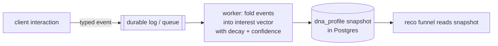
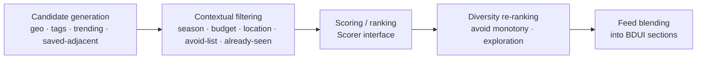

# Recommendation Engine & Explorer DNA

> The heart of the product — and the place most likely to be over-engineered.
> The design goal is: **ship a heuristic ranker today behind interfaces stable
> enough to swap in ML later, without touching any caller.**

## Explorer DNA

A per-user profile with three **explicit, interpretable** parts:

1. **Interest vector** — a fixed taxonomy of ~24 named dimensions (adventure,
   luxury, culture, nature, photography, food, hiking, road-trips, nightlife,
   wildlife, architecture, history, camping, minimalism, cold/warm, water/
   mountains, solitude/social, …). Each dimension carries `{score, confidence,
   lastUpdated}` — not an opaque embedding. Interpretability lets us explain *why*
   ("because you love cold, quiet places") and debug the model.
2. **Explicit preferences** — hard constraints: budget band, travel speed,
   comfort floor, walking tolerance, trip duration, avoid-lists.
3. **Derived context affinities** — e.g. season/weather leanings, learned over time.

### How DNA evolves (challenge to "synchronous per-interaction writes")

The brief says "every interaction updates the profile." We keep the *semantic
guarantee* but implement it **asynchronously**:



Every event *influences* DNA, but via an event fold in the `worker` — never a
blocking write on the request path. Scores **decay** over time so DNA reflects
*current* taste. **Cold start:** onboarding seeds an initial vector (see the
`onboarding.taste` BDUI screen); confidence starts low and rises with behavior.

## The recommendation funnel

A stateless, multi-stage funnel behind a single `Scorer` interface:



Stable interfaces (the whole point — swap implementations, never callers):

```ts
interface CandidateSource { generate(ctx: RecoRequest): Promise<Candidate[]>; }
interface FeatureProvider { features(userId: string, items: Candidate[]): Promise<FeatureMap>; }
interface Scorer         { score(features: FeatureMap, ctx: RecoRequest): Promise<Scored[]>; }
```

- **Phase 1 `Scorer` is heuristic** — a weighted SQL/TypeScript function over DNA
  ∩ item tags + recency + popularity + context fit. Weights are *configured*, not
  hardcoded.
- **Phase 2+** swaps in a learned ranker behind the same `Scorer` interface, with
  offline/online feature parity via the same `FeatureProvider`.

### One funnel, many surfaces

There is **one** funnel, invoked per surface with a `RecoRequest`
`{ surface, context, constraints, diversityPolicy }`. Feed, "similar
experiences," trip suggestions, and reco notifications all reuse it — no separate
"engines."

### Reco → BDUI contract (challenge to "reco emits components")

Reco does **not** emit BDUI components. It emits **semantic ranked entity
references + intent metadata**:

```jsonc
{ "items": [ { "ref": "experience:exp_101", "score": 0.87,
               "reason": "because you saved fjord hikes", "freshness": "new" } ],
  "sectionHint": "carousel", "cursor": "eyJ..." }
```

A thin BDUI composition layer (a `SectionContributor`) maps those to
`hero/carousel/card` components. This keeps reco reusable across surfaces and
keeps presentation in BDUI.

### Context features (challenge to "live weather/season per request")

Weather/season are **cached context features** keyed coarsely (region × day-
bucket), refreshed by a background job and joined like any other feature — never
a live per-request API call in the ranking hot path. Location is a request
parameter.

## Feedback & evaluation

- Impressions/exposures/saves/dismisses flow back as DNA signals and as ranking
  feedback.
- Metrics from day one: CTR, save-rate, and an **exploration/novelty** measure —
  because "inspire first" dies if the feed becomes a filter bubble. Diversity
  re-ranking explicitly injects novelty.

## Phase 1 scope (radically simplified)

- A single ranked query behind the `Scorer` interface with keyset cursor
  pagination. **No five-stage machinery, no session-pinned snapshots, no feature
  store, no streaming platform.**
- DNA = interpretable fixed-taxonomy snapshot + async fold from a durable queue.
- The stable interfaces (`CandidateSource`, `FeatureProvider`, `Scorer`,
  `RecoRequest`) are the deliverable — they are the seam that lets ML arrive
  later without a rewrite.
