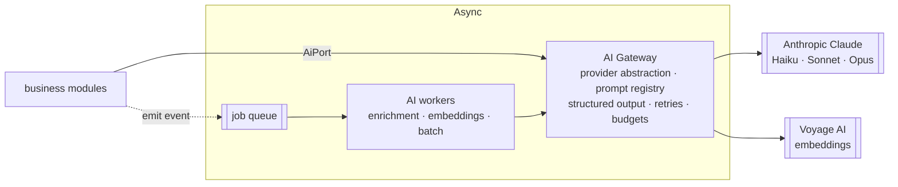

# AI Layer & Services

> Principle: **no business module ever imports the Anthropic SDK.** The domain
> depends on a narrow `AiPort` interface; infrastructure implements it. AI is
> decoupled *logically*, not fragmented into microservices operationally.

## Shape: one Gateway + a worker pool



- **Synchronous / streaming** path through the Gateway for interactive uses (trip
  assistant, semantic query understanding).
- **Asynchronous / batch** path through workers for enrichment and embeddings —
  triggered by events, never on the request hot path.

## The `AiPort`

```ts
interface AiPort {
  complete(req: PromptRequest): Promise<AiResult>;          // structured output via tool-use
  stream(req: PromptRequest): AsyncIterable<AiChunk>;
  embed(input: EmbedRequest): Promise<Float32Array[]>;      // -> EmbeddingsPort (Voyage)
}
```

The Gateway owns: **model tiering** (Haiku for cheap/high-volume, Sonnet for
reasoning, Opus for the hardest tasks — the single biggest cost lever), a
**git-backed versioned prompt registry**, **structured-output-via-tool-use** with
schema validation + repair, streaming, retries/timeouts, and **graceful
degradation** when AI is unavailable (the product must still work without AI).

## Capabilities (Phase 1 set)

| Capability | What it does | Pattern |
|---|---|---|
| **Content enrichment** | Auto-summaries, tags, draft destination stories for CMS | Batch worker → **draft → human review → publish** |
| **Semantic / NL search** | Understands "cold quiet places near fjords" | Haiku query-understanding + hybrid lexical (OpenSearch) + pgvector |
| **Trip assistant** | Helps assemble an itinerary | **Bounded** tool-use (below) |
| **Moderation** | Screens UGC | Async classify + human escalation |
| **Reco features** | Generates embedding/text features for ranking | Batch embedding pipeline |

### Bounded trip assistant (challenge to "fully agentic")

Not an open-ended autonomous agent. A **deterministic plan skeleton with LLM
slot-filling**: allow-listed tools with validated args, hard step/tool/token
ceilings, and a deterministic fallback. This keeps latency, cost, and safety
under control while still feeling intelligent.

### Embeddings (challenge to "Claude for everything")

Claude has no embeddings endpoint. Use **Voyage AI** behind an `EmbeddingsPort`.
Embedding pipeline runs as a batch worker with backfill; vectors land in pgvector
in-transaction with the entity.

## Content flow back into the platform (no tight coupling)

AI outputs never call back into modules directly. Enrichment writes **drafts**
into CMS (`review_state = 'draft'`), emits an event, and a human (or a
confidence-scored auto-approve for low-risk short fields like tags) publishes.
Stories are **grounded via RAG** over real content to reduce hallucination.

## Cost & safety controls

- **Budgets/quotas** per capability and per tenant; the Gateway enforces ceilings
  and sheds load to cheaper tiers or queues under pressure.
- **Caching** of AI outputs keyed by input hash + prompt version.
- **PII redaction** before any user data reaches a model (typed, tested — *not*
  configurable).
- **Guardrails**: schema validation on every structured output, tool-arg
  validation, and moderation of generated content before publish.

## Configure vs. code (applied to AI)

- **Configurable:** prompts, model routing, budgets, cache policy.
- **Code (typed, tested):** guardrails, schema validation, PII redaction, tool
  authorization. Never configurable.

## Phase 1 scope

The `AiPort` + Gateway skeleton (provider abstraction, prompt registry, tiering,
structured output, budgets, PII redaction), the embeddings pipeline into
pgvector, batch content enrichment with the draft→review→publish workflow, and
Haiku-powered query understanding for search. The bounded trip assistant and
moderation are specced but can trail the first shippable slice.
